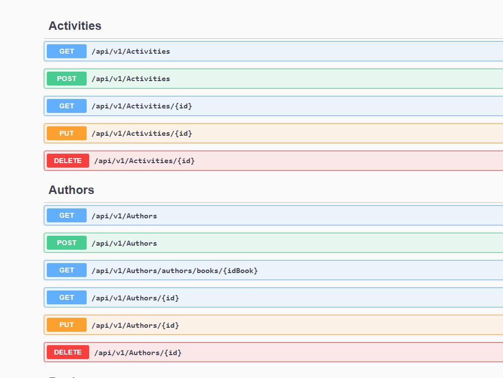

<div align="center">
  <a href="https://www.linkedin.com/posts/vishalrow_ai-appdevelopment-actions-activity-7171302152101900288-64qg?utm_source=share&utm_medium=member_desktop">
    
  </a>
</div>
<p align="center">
    
    <a target="_blank" href="https://github.com/vishalmyore/tools4ai"></a>    
</p>

### Table of Contents
- [Rapid Start](#-Rapid-Start)
- [Tools4AI](#-Tools4AI)
  - [SetUp](#setup)
  - [JavaDocs](#-JavaDocs)
  - [GCLOUD](#GCLOUD)
  - [Tools Integration](#-Tools-Integration)
  - [Reference Examples](#-Reference-Examples)  
- [Prediction Loaders](#-prediction-loaders)  
- [Response Validation](#response-validation)
  -[Hallucination](#hallucination) 
# 📌 Rapid Start
🧱 Do you want to start building ASAP , Look at Rapid start here https://github.com/vishalmysore/simplelam  

🌱 Integration of Spring Controller and AI Actions - https://github.com/vishalmysore/SpringActions  

# 💡 Tools4AI
Tools4AI is 100% Java implementation of Large Action Model (LAM) and can act as LLM agent for integraetion with enterprise 
Java applications.
This project illustrates the integration of AI with enterprise tools or external tools, converting natural language prompts
into <span style="font-size: larger;">**actionable behaviors**.</span> These prompts can be called <span style="font-size: larger;">**"action prompts"**</span>
or <span style="font-size: larger;">**"actionable prompts"**</span>  By leveraging AI capabilities, it streamlines user interactions
with complex systems, enhancing productivity and innovation across diverse applications.<br>

For example , we can integrate AI with a customer service application. Users can interact with the AI system by asking<br> 
questions or making requests in natural language. For example, a user might ask,**"Schedule a maintenance <br>
appointment for my car."** The AI system interprets the request, extracts relevant information such as the <br>
service required and preferred date, and then triggers the appropriate action in the customer service<br>
application to schedule the appointment. This seamless integration streamlines the process for users and<br>
enhances the efficiency of the customer service workflow.
<br>
| Prompt                                                                                                              | Action                                                                                                                                                |
|---------------------------------------------------------------------------------------------------------------------|-------------------------------------------------------------------------------------------------------------------------------------------------------|
| Create a <span style="color:blue">**new task**</span> for the marketing campaign.                                                                                                     | The AI system interprets the request and generates a new task entry within the project management tool dedicated to the marketing campaign, assigning it relevant details such as priority level, due date, and task description. |
| Generate a <span style="color:blue">**sales report**</span> for the previous <span style="color:blue">**quarter**</span>.                                                                 | The AI system accesses data from the company's sales database, analyzes the information for the previous quarter, and generates a comprehensive sales report, which is then delivered to the user or stored in the appropriate location for access. |
| Check the <span style="color:blue">**inventory status**</span> of <span style="color:blue">**product X.**</span>                                                                           | The AI system retrieves real-time inventory data for product X from the inventory management system and provides the user with information regarding current stock levels, including quantities available, locations, and any pending orders. |
| Schedule a <span style="color:blue">**video conference**</span> with the engineering team for next Monday at 10 AM.                                      | The AI system interfaces with the calendar and scheduling tool, creates a new event titled "Engineering Team Video Conference" for the specified date and time, and sends out meeting invitations to all members of the engineering team. |
| Submit a reimbursement request for the <span style="color:blue">**business**</span> trip <span style="color:blue">**expenses.**</span>                                                     | The AI system guides the user through the reimbursement request process, collecting necessary details such as expense receipts, dates, amounts, and purpose of expenditure. Once compiled, the system submits the reimbursement request to the appropriate department for processing. |


Prompt prediction is a technique used to anticipate user actions based on their input prompts. For instance,
if a user's prompt is "my car broke down," in addition to the action "bookTaxi," the AI system can predict a
set of subsequent actions such as "bookCarService" and "orderFood" (if it's dinner time). This predictive
capability enhances the user experience by proactively suggesting relevant actions or services based on the
context provided in the prompt.

## SetUp

Download source and build from scratch

```mvn clean install``` <br>

if you are using Intellij or eclipse make sure you set -parameters option for compiler

Or use as maven dependency 
```
<dependency>
    <groupId>io.github.vishalmysore</groupId>
    <artifactId>tools4ai</artifactId>
    <version>0.8.5</version>
</dependency>

```
check for latest version here  https://repo1.maven.org/maven2/io/github/vishalmysore/tools4ai/

## 📘 JavaDocs

Look at the java docs here - https://javadoc.io/doc/io.github.vishalmysore/tools4ai/latest/index.html


## GCLOUD
Make sure you have gcloud project set up and have enabled vertex API
```     
        String projectId = "cookgptserver" // this can be any server name you create in your GCloud
        String location = "us-central1";
        String modelName = "gemini-1.0-pro";
```
You have to mention your project id from Gcloud 

## 👉 Quick Start
```
mvn exec:java
```
The above command will run ```WeatherSearchExample``` with a prompt ```Hey I am in Toronto do you think i can go out without jacket``` 
as we all know Gemini AI (or any other AI) does not have real time weather information, Tools4AI will pick the location information from the query 
and do an api call to https://open-meteo.com/ for real time weather infomraiton which is fed back to Gemini which gives back the answer 
<br>
If you rerun this program with a new prompt ```"Hey I am in Delhi do you think i can go out without jacket, also let me know best places to visit here"``` this
will get the weather information and feed it back to Gemini and again go back with additional question and gets back with landmarks in delhi

## 🛠️ Tools Integration
```
   AITools tools = new AITools(projectId,location,modelName);
   RestaurantPojo pojo = (RestaurantPojo)tools.invokeClass(promptText,"test.com.ta.bridge.RestaurantPojo","RestaurantClass","Create Pojo from the prompt");
   return pojo.toString();

```
The above code can be executed with prompts like this <br> 
```
can you book a dinner reseration for Vishal and his family of 4 at Maharaj on Indian Independence day and make sure its cancellable

```
and it will create Pojo and can invoke method directly <br>

for example here is how a java method is mapped

```
tools.invokeMethod (prompt, JavaClassNAME, JavaMethodName)
```
The above code will map the NLP prompt to a  java method and execute the method , the argment in the method will be  
pouplated from the prompt directly so for example if you have prompt like this  
```
prompt ="give me all the Hindi movie showtimes for sunday"
```

and Map it to a JavaClass ```MovieImpl``` with Method ```getShowTime("language","day") ```
then the ```tools.invoke``` should be called with ```tools.invokeMethod(prompt,"com.package.MovieImpl","getShowTime") ```
The parameters and everything will be mapped automtically using AI and method will get invoked results will be parsed to  
AI and other tools can be chained together, in this case ```language``` will be hindi and ```day``` will be mapped to sunday    

Other Such invoke integrations are
```
tools.invokeTibco // this will create a json object and inject in Tibco based on the parameters extracted from prompts
tools.invokeDatabase //this will insert the data directly into sql db based on prompts
tools.invokeCustomApplication //parameters can be extracted from prompt and coverted into xml or json which can then be used  
                              //to call custom applicaiton for example Jira ALM etc
tools.invokeSolace
tools.invokeHTTPPOST // Call rest api based on prompt
tools.invokeHTTPGET  // call rest post method
tools.invokeMongo
```
These can be called with one single action method as well
```
tools.action(ActionType.HTTPGET, <list of arguments including prompt>)
```

or

```
tools.action(ActionType.JAVAMETHOD, <list of arguments including prompt>)

```

## ✈️ Reference Examples
These are references which i have created using the above AIAction , this shows how the actionable prompts work  
``` RecipeTasteFinder  ```  This class demonstrates function calling with mapped Hashmap response <br>
``` RecipeTasteAndDiet  ```  Execute the class for function chaining with 2 functions mapped Hashmap response <br>
``` MultiBot  ```  Run this class for function chaining with 2 functions Airline booking and restaurant booking<br>
``` UdoKhaoDekho  ```  3 functions Flight , Restaurant and Movie <br>

## 🚀 Actionable Prompts
These are the example of actionable prompts , directly take action based on the prompts

```public class MongoAction implements AIAction {``` 
The MongoAction class implements the AIAction interface, indicating that it defines an action to be performed
within an AI system. Specifically, this class is responsible for inserting data into a MongoDB database.
Method within the MongoAction class will be automatically invoked when this action is triggered,
typically in response to specific user prompts or interactions.

## 🛸 Predictable Prompts
```
@Predict 
public class MongoAction implements AIAction { 
``` 
```@Predict```Annotation will make our action predictable ,By annotating the MongoAction class with @Predict,
we are indicating that this action is predictable. This annotation instructs the AI system to automatically
call the methods within the MongoAction class when it determines that the user prompt matches the action.
In other words, if the input prompt provided by the user aligns with the behavior represented by the
MongoAction, the AI system will invoke the corresponding method within MongoAction to execute the action of 
inserting data into the MongoDB database. This predictive capability streamlines user interactions by 
automatically executing relevant actions based on user prompts.

```
@Predict
public class SendEmailAction implements AIAction {
public void sendEmail(String recipient, String message) {
// Logic to send an email to the specified recipient with the given message
}
}
```
This action is responsible for sending an email. When annotated with @Predict, the AI system will automatically
call the execute method of SendEmailAction when it predicts that the user prompt is related to sending an email.

```
@Predict
public class SearchAction implements AIAction {
    public void search(String query) {
        // Logic to perform a search with the specified query
    }
}

```
When annotated with @Predict, the AI system will call the execute method of SearchAction when it 
predicts that the user prompt is related to searching for information.

## 🧱 Prediction Loaders

### 🔑 Java Prediction Loaders

All the classes implementing ```JavaMethodAction``` interfaces and having annotation ```@Predict``` are added to prediction list
```JavaMethodAction``` is integral to creating all AI-related actions, with each action implemented as a function adhering to the principles of functional programming. The function's name should be descriptive, aligning closely with the action it performs
```@Predict``` Annotation: This annotation ensures that the AIAction object is included in our prediction list. While not mandatory, it's advisable to mark all actions with @Predict for automatic execution. However, for highly customized actions like deleting records or canceling reservations, omitting this annotation might be preferable to prevent automatic execution.

```actionName``` the descriptive name of the primary function within the class. It's crucial to name this function accurately, as AI utilizes semantic mapping at runtime to correlate the function.

```
@Predict(actionName = "whatFoodDoesThisPersonLike", description = "what is the food preference of this person ")
public class SimpleAction implements JavaMethodAction {

    public String whatFoodDoesThisPersonLike(String name) {
        if("vishal".equalsIgnoreCase(name))
            return "Paneer Butter Masala";
        else if ("vinod".equalsIgnoreCase(name)) {
            return "aloo kofta";
        }else
            return "something yummy";
    }

}

```

So prompt like ```Hey Vishal is coming to my house for dinner``` will automatically trigger method ```whatFoodDoesThisPersonLike``` with ```name``` Vishal

### 🖌️ Shell Prediction Loader  

The prediction loader is responsible for loading command scripts, shell scripts, Python scripts, or any other
type of script from configuration files. It utilizes the actionName field from the configuration to map to 
prompts in real-time. Here's an example configuration entry: 

```
- scriptName: "test_script.cmd"
  actionName: saveEmployeeInformation
  parameters: employeeName,employeeLocation
  description: This is a command which will save employee information
 ```
During runtime, the prediction loader dynamically extracts parameters from the prompt. Subsequently, it invokes 
the corresponding script based on the action name. Upon execution, the script processes the parameters and 
generates a result, which is then sent back to the AI system.  Finally, the AI system formulates a response based on the received result and provides feedback accordingly.
User: "Hey, Bahubali joined the IFC and we are so happy."

In this prompt:

"Hey" serves as a casual greeting.
"Bahubali" represents the name of the new joiner, which needs to be extracted as a parameter.
"joined the IFC" implies an action, where the specifics of the action need to be determined. "IFC" is the name of the organization.
"we are so happy" provides additional context but doesn't directly affect the action to be taken.
The AI system first matches the user's intent with a list of all available actions. In this case, it selects the "saveEmployeeInformation" action as the best match. Then, it maps the parameters accordingly: "Bahubali" as the employee's name and "IFC" as the organization's name. This allows the AI system to accurately understand and execute the user's request.

### ✒️ Swagger Prediction Loader  


The Swagger Prediction Loader is capable of directly loading HTTP endpoints as predictions, enabling automatic
execution of commands that semantically match the endpoints with extracted parameters. The screenshot provided
is from https://fakerestapi.azurewebsites.net/index.html, included as an example. Each endpoint within this 
API is converted to an ```HttpPredictedAction``` and dynamically added to the prediction list in real-time by the 
```SwaggerPredictionLoader.``` 

This seamless integration allows for streamlined execution of commands based on the available HTTP endpoints.
**Parsing Swagger/OpenAPI Specification:** The Swagger Prediction Loader reads the Swagger/OpenAPI specification file, which describes the available endpoints, their methods (e.g., GET, POST), parameters, and other details.

**Endpoint Extraction:** The loader extracts each endpoint from the specification, along with its associated metadata such as method, path, parameters, etc.

**Action Mapping:** For each endpoint, the loader creates an HttpPredictedAction object. This action represents the corresponding HTTP operation (e.g., GET, POST) that clients can perform on the endpoint.

**Parameter Extraction:** The loader extracts parameters defined for each endpoint, such as query parameters, path parameters, headers, etc.

**Action Configuration:** The extracted parameters are configured within the HttpPredictedAction object, allowing for dynamic parameterization during execution. Parameters may be mapped to placeholders within the endpoint URL or included in the request body, headers, etc., as specified by the endpoint definition.

**Addition to Prediction List:** Finally, the HttpPredictedAction objects are added to the prediction list, making them available for automatic execution based on user prompts. Users can invoke actions by providing prompts that match the semantic intent of the mapped endpoints, and the system will execute the corresponding HTTP operation with the extracted parameters.

In essence, the Swagger Prediction Loader leverages the structure and metadata defined in the Swagger/OpenAPI
specification to dynamically create HttpPredictedAction objects, allowing for seamless integration of HTTP
endpoints into the prediction system

### ✍️ Http Prediction Loader

```HttpPredictionLoader``` is responsible for loading the manual http endpoint configuration which look something like this 

```{
  "endpoints": [
    {
      "actionName": "getUserDetails",
      "description" : " this will fetch User details from the user inventory corporate application",
      "url": "https://api.example.com/users/",
      "type": "GET",
      "input_object": [
      {
        "name": "userId",
        "type": "path_parameter",
        "description": "User ID"
      }
      ],

      "output_object": {
        "type": "json",
        "description": "User object"
      },
      "auth_interface": {
        "type": "Bearer Token",
        "description": "Authentication token required"
      }
    },
```
For the manual definition of HTTP endpoints using a configuration file like the one provided, the process involves specifying each endpoint along with its associated details such as action name, description, URL, HTTP method (type), input parameters, output object, and authentication interface. Here's how the mapping process occurs:

**Configuration File Parsing:** The application parses the configuration file to extract each endpoint definition along with its metadata.

**Endpoint Mapping:** For each endpoint defined in the configuration file, an HttpPredictedAction object is created to represent the corresponding HTTP operation.

**Action Configuration:** The metadata provided in the configuration file is used to configure the HttpPredictedAction object:

**Action Name:** Specifies the name of the action, which serves as a unique identifier.  
**Description:** Provides a brief description of what the action does or its purpose.  
**URL:** Defines the endpoint URL to which the HTTP request will be sent.  
**HTTP Method (Type):** Specifies the HTTP method (e.g., GET, POST) to be used for the request.  
**Input Parameters:** Describes the input parameters required for the HTTP request, such as path parameters, query parameters, etc.  
**Output Object:** Defines the format and structure of the response expected from the endpoint.  
**Authentication Interface:** Specifies the authentication mechanism required to access the endpoint, along with any necessary credentials.  
**Parameter Extraction:** The input parameters defined for each endpoint are extracted and configured within the HttpPredictedAction object.  

**Addition to Prediction List:** Finally, the HttpPredictedAction objects representing the manually defined endpoints are added to the prediction list, making them available for automatic execution based on user prompts.

This approach allows for flexibility in defining HTTP endpoints outside of a Swagger/OpenAPI specification, enabling the manual configuration of endpoints to suit specific application requirements.

### 🖊️ Extended Prediction Loader
The ```ExtendedPredictionLoader``` offers a mechanism for creating custom prediction loaders. While Shell, HTTP, and Java Methods are supported by default, there may arise situations or use cases necessitating a custom set of actions. It's important to note the distinction between custom actions and ```ExtendedPredictedAction.``` Custom actions can be created by implementing the AIAction class, while ExtendedPredictedAction have their own loading mechanism. These actions are already present in the prediction list by default and cannot be predicted again.

To create custom implementations of ExtendedPredictionLoader, you need to annotate the loader class with ```@ActivateLoader.``` Prediction loader will then identify all classes with this annotation and call the ```getExtendedActions()``` method. This method should return the action names along with their corresponding ExtendedPredictOptions, allowing for the seamless integration of custom actions into the prediction system.


## Response Validation

### Hallucination

```ZeroShotHallucinationDetector``` is designed to assess the consistency of responses generated by a Large Language Model (LLM) and detect potential hallucinations. It operates by breaking down an original question into multiple granular questions, each probing different aspects or variations of the inquiry. These granular questions are then presented to the LLM separately, generating responses that are subsequently compared to the original question within its original context.

During comparison, factors such as semantic coherence, relevance, and contextual alignment are evaluated to quantify the consistency between each response and the original question. This evaluation results in a percentage score for each response, representing its level of conformity with the original query.

Finally, these individual percentage scores are aggregated to calculate a cumulative percentage. If the cumulative percentage surpasses a predefined threshold, it indicates a discrepancy or potential hallucination.

By systematically analyzing responses in this manner, the class provides a robust mechanism for assessing the reliability and coherence of LLM-generated content.

This method employs a Zero Shot approach to detect hallucination, utilizing a straightforward methodology devoid of external sources. It operates as follows:

Input: The method takes in responses generated by the Large Language Model (LLM) without relying on any additional data sources.

Granular Analysis: It breaks down the original question into multiple granular inquiries, covering diverse aspects or variations of the initial query.

Zero Shot Evaluation: Without external references, the method evaluates each response against the original question, assessing factors such as semantic coherence and contextual relevance.

Consistency Assessment: Based on the comparison, the method quantifies the consistency of each response, assigning a score indicative of its conformity with the original query.

Cumulative Evaluation: These individual scores are then aggregated to derive a cumulative assessment, providing insight into the overall coherence of the LLM-generated responses.

By employing a simple yet effective Zero Shot technique, this method offers a streamlined approach to detect potential hallucinations in LLM-generated content, contributing to the reliability and trustworthiness of AI-generated outputs.

### Bias
### Fairness


## Advanced Reference Examples

This will do a google search and return the result can be combined with multiaction  
```
ActionProcessor processor = new ActionProcessor();
String news = (String)processor.processSingleAction("can you search the web for Indian news");

```
Guard Rails with Spring security 
``` Security - Guard Rails using Spring Security``` TBD <br>
``` Application Checkout and monitoring using with Gemini - Prompt - Check if my restaurant system is up and running and able to book the reservation``` TBD <br>
``` Validation with Prompt  - Prompt - What happened the the flight booking i made whats the status?```TBD <br>

## 🧾 Advanced prompt function calling
``` Can you check if my movie booking system can handle 50 reservations in 1 min ``` <br>
``` what happens if my cookgpt is giving only vegetarian recipes``` <br>